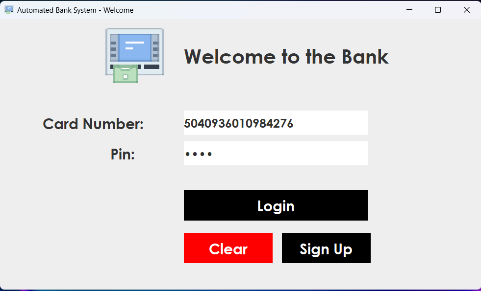
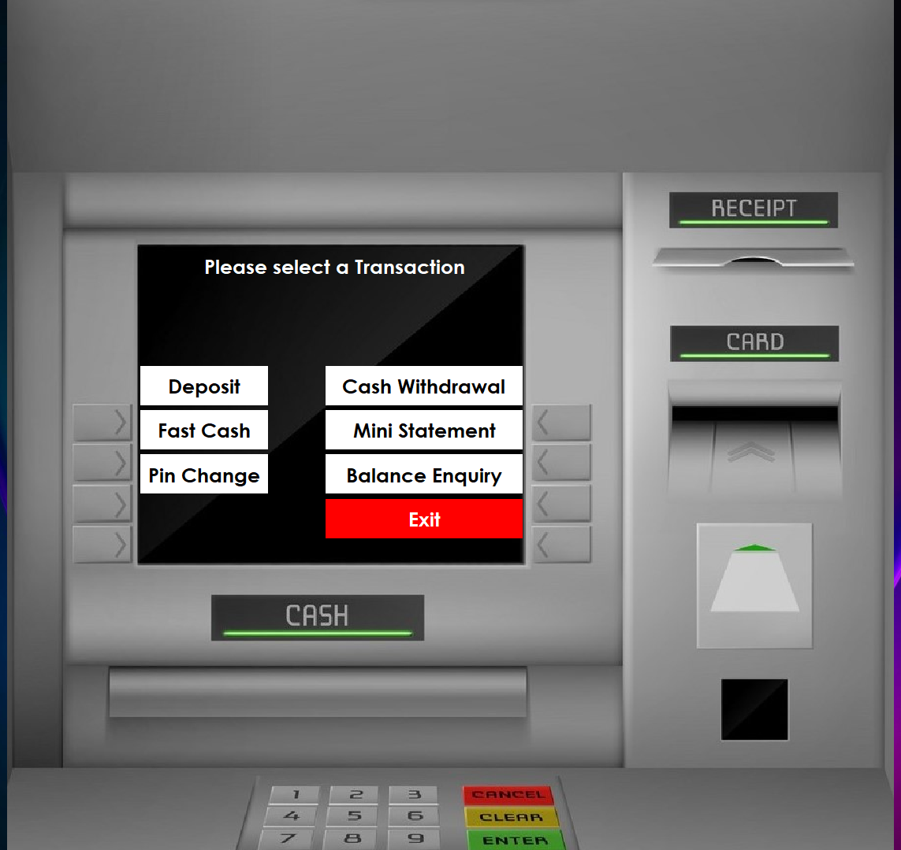

# Java Bank Management System

The Bank Management System is a Java application that enables users to perform various banking operations. It includes features like user authentication, account creation, and transaction management.

## Table of Contents

- [Java Bank Management System](#java-bank-management-system)
  - [Table of Contents](#table-of-contents)
  - [Features](#features)
  - [Screenshots](#screenshots)
  - [Getting Started](#getting-started)
  - [Dependencies](#dependencies)
  - [Usage](#usage)
  - [Contributions](#contributions)
  - [License](#license)

## Features

1. **User Authentication:**
   - Secure login functionality for authorized access.
{ width=50% }

2. **Account Creation:**
   - Three-step sign-up process for personal details, additional details, and account details.
    { width=50%, margin-right=20px }
    

3. **Transaction Management:**
   - Withdrawal
   - Deposit
   - FastCash
   - Balance Enquiry
   - Pin Change
   - Mini Statement

## Screenshots



## Getting Started

1. **Clone the repository:**

    ```bash
    git clone https://github.com/nnoromiv/bankManagementSystem.git
    ```

2. **Database Setup:**

    Create a MySQL database and import the provided SQL schema file.

3. **Dependencies:**

    Ensure all dependencies are installed (Java, MySQL Connector, etc.).

4. **Run the Application:**

    ```bash
        javac App.java
        java App
    ```

## Dependencies

-Java
-MySQL Connector

## Usage

1. Sign Up:

   - Click the Sign up button.
   - Provide dummy details to fill in personal details, additional details, and account details during the sign-up process.
   - Copy out the Card Number and Pin that is generated.

2. Login:

    - Use the Card Number and Pin to log in securely.
  
3. Perform Transactions:

    - Explore various transaction options from the menu.

## Contributions

Contributions are welcome! Feel free to submit issues or pull requests.
    - Bug Fixes
    - Feature Enhancements
    - Documentation Improvements

## License

This project is licensed under the MIT License - see the LICENSE file for details.
